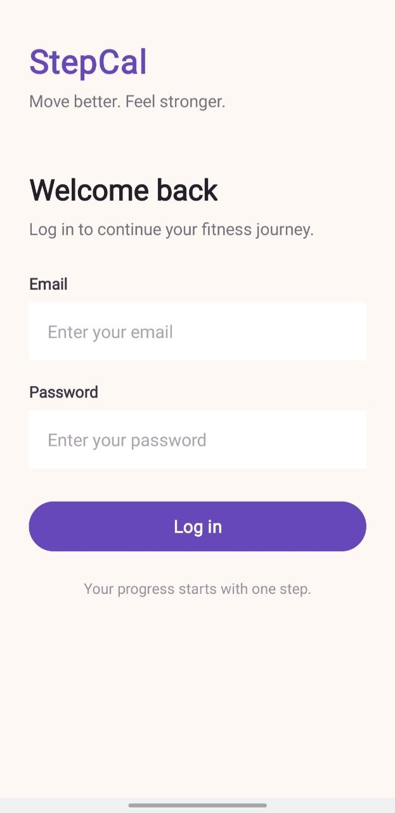
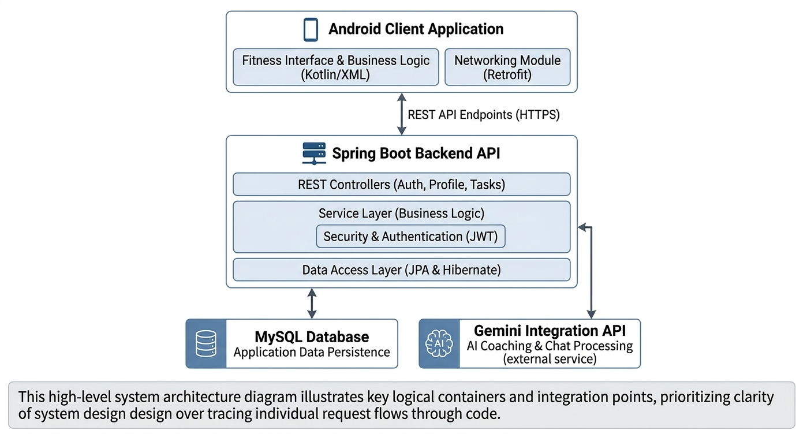

# StepCal Capture

StepCal Capture is an Android fitness-tracking application designed to bring everyday activity tracking and personalized fitness goals into one place. The project combines a Java-based Android application with a Spring Boot backend, MySQL persistence, JWT-based authentication, and an AI-powered fitness chat assistant.

Originally started as a team project for **CSC299 (Junior Project Design)**, a second-year undergraduate course, the project was left with an unfinished implementation and features that fell short of the original vision.

After graduation, I revisited the project to strengthen my software development skills and bring that vision closer to reality. I expanded the feature set, refined existing functionality, and worked through implementation, integration, debugging, and security improvements, using the free version of ChatGPT as a learning and development assistant.

## Screenshots

<table>
  <tr>
    <td align="center" width="33%">
      <br>
      <sub><strong>Login</strong></sub>
    </td>
    <td align="center" width="33%">
      <br>
      <sub><strong>Step Count</strong></sub>
    </td>
    <td align="center" width="33%">
      <br>
      <sub><strong>Today's Plan</strong></sub>
    </td>
  </tr>
  <tr>
    <td align="center" width="33%">
      <br>
      <sub><strong>Today's Progress</strong></sub>
    </td>
    <td align="center" width="33%">
      <br>
      <sub><strong>My Profile</strong></sub>
    </td>
    <td align="center" width="33%">
      <br>
      <sub><strong>StepCal Coach</strong></sub>
    </td>
  </tr>
</table>

## Features

- **Step Tracking** — tracks walking activity using supported Android step sensors.
- **Calorie Tracking** — calculates calorie estimates and integrates activity data with the backend.
- **Daily Tasks and Progress** — retrieves fitness tasks and records completed activity.
- **User Profiles** — retrieves profile information used by the fitness features.
- **Authentication** — registration and login with JWT-based authentication for protected API endpoints.
- **AI Fitness Coach** — integrates Google's Gemini API through the Spring Boot backend for conversational fitness assistance.
- **Backend Integration** — connects the Android application to REST endpoints backed by MySQL.

## Technology Stack

| Component | Technologies |
|---|---|
| Android Frontend | Java, XML, Android SDK |
| UI | AndroidX AppCompat, Material Components, ConstraintLayout |
| API Communication | Retrofit, Gson |
| Location Services | Google Play Services Location |
| Maps Dependency | MapLibre Native for Android |
| Backend | Java, Spring Boot 3.2.4 |
| Security | Spring Security, JSON Web Tokens (JWT) |
| Database | MySQL, Spring Data JPA, Hibernate |
| AI Integration | Google Gemini API, Google GenAI SDK |
| Additional Backend Support | Spring Mail, WebSocket |
| Testing | JUnit 5, Spring Boot Test, AndroidX Test, Espresso |
| Build Tools | Gradle, Maven |

## Architecture

StepCal Capture uses a client-server architecture.

<p align="center">
  
</p>

<p align="center"><em>High-level architecture of the StepCal Capture application and its backend services.</em></p>

- **Android client:** provides the fitness-tracking interface and communicates with backend endpoints through Retrofit.
- **Spring Boot backend:** exposes REST endpoints for authentication, profile information, task management, and AI chat.
- **MySQL database:** persists application data through Spring Data JPA and Hibernate.
- **Gemini integration:** processes fitness-chat requests through the backend, keeping the AI integration separate from the Android client.

The Android application and backend are maintained in the same repository.

## Repository Layout

```text
StepCal-Capture/
├── frontend/       # Android application
├── backend/        # Spring Boot REST API
├── docs/           # Project documentation and engineering report
├── screenshots/    # App screenshots and architecture diagram
├── .gitignore
└── README.md
```

## Quick Start — Windows

### Prerequisites

- Windows 10 or 11
- Android Studio and a compatible Android SDK
- A compatible JDK for the Android project
- JDK 17 or newer for the backend
- MySQL Server
- A Gemini API key for the AI fitness coach

### 1. Clone the repository

```bat
git clone https://github.com/Estehaar-sc/StepCal-Capture.git
cd StepCal-Capture
```

### 2. Configure the database

Create a MySQL database named `stepcal` on your local MySQL server.

The development configuration expects MySQL at `localhost:3306`, with the database username `root` by default. Configure your local database password through the `DB_PASSWORD` environment variable.

Hibernate is configured to update the development schema automatically. Verify the database connection and schema before using the application.

### 3. Configure backend environment variables

The backend reads sensitive configuration from environment variables rather than requiring API keys or passwords to be committed to the repository.

| Variable | Purpose |
|---|---|
| `DB_PASSWORD` | Local MySQL password |
| `GEMINI_API_KEY` | Google Gemini API access |
| `JWT_SECRET_BASE64` | Base64-encoded secret used to sign JWTs |
| `MAIL_USERNAME` | SMTP account for email functionality |
| `MAIL_PASSWORD` | SMTP account password or app password |

The production profile additionally requires `DB_URL` and `DB_USERNAME`.

Set the appropriate variables in your local Windows environment or development terminal before starting the backend. Use your own credentials and keep them out of source control.

### 4. Run the backend

Open Command Prompt in the repository root and run:

```bat
cd backend
mvnw.cmd spring-boot:run
```

If necessary, set `JAVA_HOME` to your installed JDK and ensure its `bin` directory is on `PATH`.

The development server uses port `4006` by default.

### 5. Build the Android application

Open the `frontend` directory in Android Studio and allow Gradle synchronization to finish.

Alternatively, from Command Prompt in the repository root, run:

```bat
cd frontend
gradlew.bat assembleDebug
```

The debug APK is generated under:

```text
frontend/app/build/outputs/apk/debug/
```

### 6. Connect the Android client to the backend

The current development configuration uses a local-network backend address. For testing on a physical Android device, the phone and development computer must be able to reach one another over the network, and the backend port must be accessible.

Update the Android API base URL to match your development environment when necessary. The current local-network configuration is intended for development and is **not a public production endpoint**.

For remote deployment, use a properly secured HTTPS backend and configure the Android client accordingly.

## Configuration and Security

- Never commit API keys, database passwords, email credentials, JWT secrets, or private environment files.
- Keep local configuration files out of Git and use environment variables for sensitive settings.
- Rotate credentials if they have been exposed.
- Use HTTPS, appropriate access controls, and request-abuse protections before deploying the backend publicly.
- Review inherited code and resolve ownership and permission questions before commercial use or redistribution.

## Development Status

StepCal Capture is a personal development project. The Android client and Spring Boot backend have been integrated and tested in a local development environment.

The backend has passed compilation checks and a lightweight JUnit test. That test verifies the Spring Boot annotation on the main application class; it does not constitute a full application-startup or integration test.

### Roadmap

- Expand automated backend and Android test coverage.
- Improve configuration for development and production environments.
- Complete the security and credential-handling audit.
- Improve deployment and setup documentation.
- Continue refining the fitness-tracking experience and AI coach.

## Project Report

The detailed engineering report documents the project background, architecture, implementation decisions, security work, build and test results, known limitations, and future improvements.

See the [Project Report](docs/PROJECT_REPORT.md).

## License

**Proprietary — All rights reserved.**

StepCal Capture is shared publicly for portfolio and demonstration purposes only. No license is currently granted to copy, modify, redistribute, or use this project commercially. Licensing and contribution rights will be reviewed before any public launch.

Some portions originated in an earlier team project; ownership and permissions for those contributions have not yet been fully confirmed.
